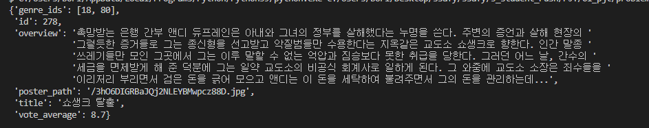
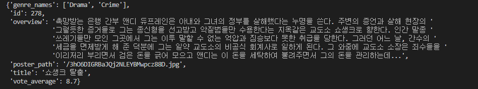
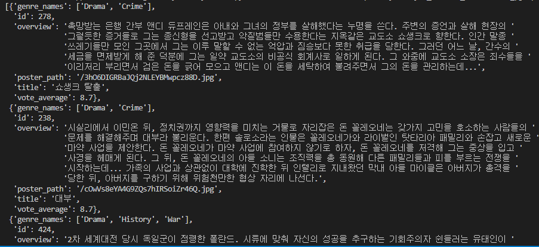
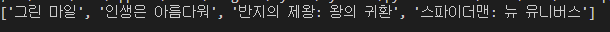
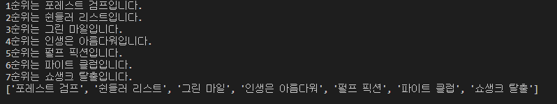

A. 제공되는 영화 데이터의 주요내용 수집 (problem_a)

요구사항

- movie.json에서 id, title, poster_path, vote_average, overview,
  genre_ids 키에 해당하는 값을 추출합니다.
- 추출한 값을 새로운 dictionary로 반환하는 함수 movie_info를 완성합니다.

작성코드

```
import json
from pprint import pprint


def movie_info(movie):
    genre_ids = movie.get('genre_ids')
    id = movie.get('id')
    overview = movie.get('overview')
    poster_path = movie.get('poster_path')
    title = movie.get('title')
    vote_average = movie.get('vote_average')
    info = {'genre_ids':genre_ids, 'id':id, 'overview':overview, 
            'poster_path':poster_path, 'title':title, 'vote_average':vote_average}
    return info

if __name__ == '__main__':
    movie_json = open('data/movie.json', encoding='utf-8')
    movie_dict = json.load(movie_json)

    pprint(movie_info(movie_dict))
```

결과



느낀점

json을 써보면서 파일을 불러오고 딕셔너리부분은 .get을 이용해서 사용하는것을 알게 되었습니다.

---

B. 제공되는 영화 데이터의 주요내용 수정 (problem_b)

요구사항

이전 단계에서 만들었던 데이터 중 genre_ids를 장르 번호가 아닌 장르 이름 리스트
genre_names로 바꿔 반환하는 함수를 완성합니다.

작성코드

```
import json
from pprint import pprint


def movie_info(movie, genres):
    genre_ids = movie.get('genre_ids')
    genre_names = []
    for i in range(len(genre_ids)):
        # genre_ids 순차 뽑기 = genre_ids[i]
        for j in range(len(genres)):
            if genres[j].get('id') == genre_ids[i]:
                genre_names.append(genres[j].get('name'))
    id = movie.get('id')
    overview = movie.get('overview')
    poster_path = movie.get('poster_path')
    title = movie.get('title')
    vote_average = movie.get('vote_average')
    info = {'genre_names':genre_names, 'id':id, 'overview':overview, 
            'poster_path':poster_path, 'title':title, 'vote_average':vote_average}
    return info    

if __name__ == '__main__':
    movie_json = open('data/movie.json', encoding='utf-8')
    movie = json.load(movie_json)

    genres_json = open('data/genres.json', encoding='utf-8')
    genres_list = json.load(genres_json)

    pprint(movie_info(movie, genres_list))
```

결과



느낀점

2중 for문을 사용하면서 반복되는 순서에 대해서 생각해 볼 수 있었고 아직까지 key, value를 다루는게 어렵습니다.

---

C. 다중 데이터 분석 및 수정 (problem_c)

요구사항

- movies.json에는 평점이 높은 20개의 영화 데이터가 주어집니다. 이 중 서비스 구
  성에 필요한 정보만 추출해 반환하는 함수를 완성합니다.

코드작성

```
import json
from pprint import pprint

#함수 재사용!!!!
#b번 문제: 장르값 불러오는 함수를 사용한다.
def genres_movie(movie, genres):
    genre_ids = movie.get('genre_ids')
    genre_names = []
    for i in range(len(genre_ids)):
        # genre_ids 순차 뽑기 = genre_ids[i]
        for j in range(len(genres)):
            if genres[j].get('id') == genre_ids[i]:
                genre_names.append(genres[j].get('name'))
    return genre_names    

def movie_info(movies, genres):
    new_info = []
    for i in range(len(movies)):
        genre_ids = movies[i].get('genre_ids')
        genre_names = genres_movie( movies[i], genres)
        id = movies[i].get('id')
        overview = movies[i].get('overview')
        poster_path = movies[i].get('poster_path')
        title = movies[i].get('title')
        vote_average = movies[i].get('vote_average')
        info = {'genre_names':genre_names, 'id':id, 'overview':overview, 
                'poster_path':poster_path, 'title':title, 'vote_average':vote_average}    
        new_info.append(info)
    return new_info

if __name__ == '__main__':
    movies_json = open('data/movies.json', encoding='utf-8')
    movies_list = json.load(movies_json)

    genres_json = open('data/genres.json', encoding='utf-8')
    genres_list = json.load(genres_json)

    pprint(movie_info(movies_list, genres_list))
```

결과



느낀점

이전 단계 코드를 재사용(복붙후 수정)하면서 나름 간단하게 작업했다고 생각했는데 다른 학생분들과 코드를 공유하면서 이전 단계의 함수를 통째로 복붙해서 함수를 사용하는게 좀더 편하다가 생각했고 코드를 공유하면서 배울 수 있었습니다.

---

D. 알고리즘을 사용한 데이터 출력 (problem_d)

요구사항

- 영화 세부 정보 중 수입 정보(revenue)를 이용하여 모든 영화 중 가장 높은 수익을
  낸 영화를 출력하는 알고리즘을 작성합니다.

코드작성

```
import json


def max_revenue(movies):
    # 수익이 최고일 경우
    max_rev = 0
    max_title = ''  
    for i in range(len(movies)):
        #폴더내 파일을 열기위한 파일이름(id)가 필요
        file_name = str(movies[i].get('id'))+'.json'
        #파일을 오픈하면 title과 revenue를 불러올 수 있다.
        json_movie = open(f'data/movies/{file_name}', encoding='utf-8')
        list_movie = json.load(json_movie)
        if list_movie.get('revenue') > max_rev:
            max_rev = list_movie.get('revenue')
            max_title = list_movie.get('title')

    return max_title

if __name__ == '__main__':
    movies_json = open('data/movies.json', encoding='utf-8')
    movies_list = json.load(movies_json)

    print(max_revenue(movies_list))
```

결과


느낀점

이전 단계 코드를 재사용(복붙후 수정)하면서 나름 간단하게 작업했다고 생각했는데 다른 학생분들과 코드를 공유하면서 이전 단계의 함수를 통째로 복붙해서 함수를 사용하는게 좀더 편하다가 생각했고 코드를 공유하면서 배울 수 있었습니다.

---

E. 알고리즘을 사용한 데이터 출력 (problem_e)

요구사항

- 영화 세부 정보 중 개봉일 정보(release_date)를 이용하여 모든 영화 중 12월에 개
  봉한 영화들의 제목 리스트를 출력하는 알고리즘을 작성합니다.

코드작성

```
import json

def dec_movies(movies):
    title_movie = []
    for i in range(len(movies)):
        #폴더내 파일을 열기위한 파일이름(id)가 필요
        file_name = str(movies[i].get('id'))+'.json'
        #파일을 오픈하면 title과 revenue를 불러올 수 있다.
        json_movie = open(f'data/movies/{file_name}', encoding='utf-8')
        list_movie = json.load(json_movie)
        month_movie = list_movie.get("release_date")[5:7]
        if month_movie == '12':
            title_movie.append(list_movie.get('title'))

    return title_movie

if __name__ == '__main__':
    movies_json = open('data/movies.json', encoding='utf-8')
    movies_list = json.load(movies_json)

    print(dec_movies(movies_list))
```

F. 알고리즘을 사용한 데이터 출력 (problem_f)

요구사항

- 90년대 개봉작 중 많은 수입을 올린 영화 순위

결과



느낀점

파일 경로를 직접 만들어서 여는것도 신기했습니다. 작업중 수익과 제목을 한번에 정렬해서 return해주고 싶었는데 아직까지는 각각 list를 만들어서 정렬하는게 편하고 잘 모르겠습니다.

---

코드작성

```
import json
from pprint import pprint
#배급한 영화가 많은 순으로 배급사 정렬하기

def movie_info(movies):
    prod = {}
    for i in range(len(movies)):
        #폴더내 파일을 열기위한 파일이름(id)가 필요
        file_name = str(movies[i].get('id'))+'.json'
        #파일을 오픈하면 title과 revenue를 불러올 수 있다.
        json_movie = open(f'data/movies/{file_name}', encoding='utf-8')
        list_movie = json.load(json_movie)
        for j in range(len(list_movie.get("production_companies"))):
            name_prod = list_movie.get("production_companies")[j].get("name")
            if name_prod not in prod:
                prod[name_prod] = 1
            else:
                prod[name_prod] += 1
    cnt_prod = list(prod.values())
    erum_prod = list(prod.keys())
    for i in range(len(cnt_prod)-1):
        for j in range(i+1, len(cnt_prod)-1):
            if cnt_prod[i] < cnt_prod[j]:
                cnt_prod[i], cnt_prod[j] = cnt_prod[j], cnt_prod[i]
                erum_prod[i], erum_prod[j] = erum_prod[j], erum_prod[i]

    for i in range(len(erum_prod)):
        a = f"{i+1}순위 {erum_prod[i]}: {cnt_prod[i]}회"    
        print(a)

    return erum_prod

if __name__ == '__main__':
    movies_json = open('data/movies.json', encoding='utf-8')
    movies_list = json.load(movies_json)

    pprint(movie_info(movies_list))
```

결과



느낀점

전체적으로 머리 쥐어짜면서 재밌게 코드도 짜고 주면 동기학생분들과 코드공유도할 수 있었던 프로젝트였습니다. 감사합니다.

---