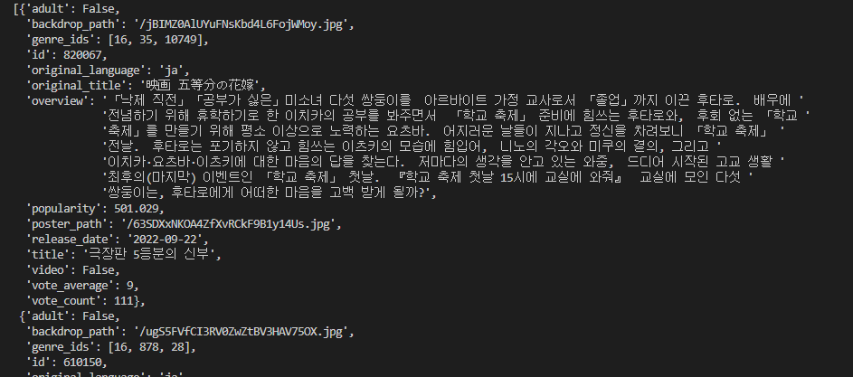

# 02_pjt 후기

1. 인기영화 조회(problem_a)
   
   요구사항
   
   - 인기 영화 목록을 응답 받아 개수를 출력합니다.
   
   코드작성
   
   ```
   import pprint
   import requests
   
   def popular_count():
      #우리가 최종 요청 주소:
      #https://api.themoviedb.org/3/movie/popular?api_key=<<api_key>>&language=en-US&page=1
      #             보통 물음표 뒤가 params       ?api_key=<<api_key>>&language=en-US&page=1 
      #대문자 변수 = 상수
      BASE_URL = 'https://api.themoviedb.org/3'
      #주소 뒷부분 상세 경로
      path = '/movie/popular'
   
      #params: 요청할 데이터 조건들
      #같은 표현으로 query_string: 보통 ?뒤에 있기때문에
      query_string = {
         'api_key': 'd77a958e646191ffe9107d07477129e7',
         'language': 'ko',
         'region': 'KR',
      }
      #reponse는 딕셔너리, 보통은 딕셔너리
      response = requests.get(BASE_URL + path, params = query_string).json()
      #pprint.pprint(response)
      #result는 리스트(api마다 응답이 다르게 오는데, 여기서는 리스트)
      result = response.get('results')
      #pprint.pprint(result)
      return len(result)
   
   if __name__ == '__main__':
      """
      popular 영화목록의 개수 반환
      """
      pprint.pprint(popular_count())
      # 20
   ```
   
   결과
   
   

   느낀점

   처음 설명해주시는 개념을 이용해서 쉽게 풀 수 있었습니다.

---

2. 특정조건 인기영화 조회(problem_b)
   
   요구사항
   
   - 인기 영화 목록 중 평점이 8점 이상인 영화 목록을 출력합니다.
   
   코드작성
   
   ```
   import requests
   from pprint import pprint
   
   def vote_average_movies():
      #우리가 최종 요청 주소:
      #https://api.themoviedb.org/3/movie/popular?api_key=<<api_key>>&language=en-US&page=1
      #             보통 물음표 뒤가 params       ?api_key=<<api_key>>&language=en-US&page=1 
      #대문자 변수 = 상수
      BASE_URL = 'https://api.themoviedb.org/3'
      #주소 뒷부분 상세 경로
      path = '/movie/popular'
   
      #params: 요청할 데이터 조건들
      #같은 표현으로 query_string: 보통 ?뒤에 있기때문에
      query_string = {
         'api_key': 'd77a958e646191ffe9107d07477129e7',
         'language': 'ko',
         'region': 'KR',
      }
      #reponse는 딕셔너리, 보통은 딕셔너리
      response = requests.get(BASE_URL + path, params = query_string).json()
      #pprint.pprint(response)
      #result는 리스트(api마다 응답이 다르게 오는데, 여기서는 리스트)
      result = response.get('results')
      #pprint.pprint(result)
      ans = []
      for i in range(len(result)):
         if result[i].get('vote_average') >= 8:
         ans.append(result[i])
      return ans
   
   if __name__ == '__main__':
      """
      popular 영화목록중 vote_average가 8 이상인 영화목록 반환
      (주의) popular 영화목록의 경우 시기에 따라 아래 예시 출력과 차이가 있을 수 있음
      """
      pprint(vote_average_movies())
      """
      [{'adult': False,
         'backdrop_path': '/ocUp7DJBIc8VJgLEw1prcyK1dYv.jpg',
         'genre_ids': [28, 12, 878],
         'id': 634649,
         'original_language': 'en',
         'original_title': 'Spider-Man: No Way Home',
         'overview': '미스테리오의 계략으로 세상에 정체가 탄로난 스파이더맨 피터 파커는 하루 아침에 평범한 일상을 잃게 된다. 문제를 '
                     '해결하기 위해 닥터 스트레인지를 찾아가 도움을 청하지만 뜻하지 않게 멀티버스가 열리면서 각기 다른 차원의 '
                     '불청객들이 나타난다. 닥터 옥토퍼스를 비롯해 스파이더맨에게 깊은 원한을 가진 숙적들의 강력한 공격에 피터 파커는 '
                     '사상 최악의 위기를 맞게 되는데…',
         'popularity': 1842.592,
         'poster_path': '/voddFVdjUoAtfoZZp2RUmuZILDI.jpg',
         'release_date': '2021-12-15',
         'title': '스파이더맨: 노 웨이 홈',
         'video': False,
         'vote_average': 8.1,
         'vote_count': 13954},
      ..생략..,
      }]
      """
   ```
   
   결과
   
   

   느낀점

   1번이랑 비슷한 유형이란 느낌을 받았습니다.

---

3. 특정조건 인기영화 top5조회(problem_c)
   
   요구사항
   
   - 인기 영화 목록을 평점이 높은 순으로 5개의 영화 데이터 목록을 출력합니다.
   
   코드작성
   
   ```
   from operator import itemgetter
   import requests
   from pprint import pprint
   
   def ranking():
      #우리가 최종 요청 주소:
      #https://api.themoviedb.org/3/movie/popular?api_key=<<api_key>>&language=en-US&page=1
      #             보통 물음표 뒤가 params       ?api_key=<<api_key>>&language=en-US&page=1 
      #대문자 변수 = 상수
      BASE_URL = 'https://api.themoviedb.org/3'
      #주소 뒷부분 상세 경로
      path = '/movie/popular'
   
      #params: 요청할 데이터 조건들
      #같은 표현으로 query_string: 보통 ?뒤에 있기때문에
      query_string = {
         'api_key': 'd77a958e646191ffe9107d07477129e7',
         'language': 'ko',
         'region': 'KR',
      }
      #reponse는 딕셔너리, 보통은 딕셔너리
      response = requests.get(BASE_URL + path, params = query_string).json()
      #pprint.pprint(response)
      #result는 리스트(api마다 응답이 다르게 오는데, 여기서는 리스트)
      result = response.get('results')
      #pprint.pprint(result)
      sort_result = sorted(result, key=itemgetter('vote_average'))
      ans = []
      for i in range(-1, -6, -1):
         ans.append(sort_result[i])
      return ans
   
   if __name__ == '__main__':
      """
      popular 영화목록을 정렬하여 평점순으로 5개 영화 반환
      (주의) popular 영화목록의 경우 시기에 따라 아래 예시 출력과 차이가 있을 수 있음
      """
      pprint(ranking())
      """
      [{'adult': False,
         'backdrop_path': '/odJ4hx6g6vBt4lBWKFD1tI8WS4x.jpg',
         'genre_ids': [28, 18],
         'id': 361743,
         'original_language': 'en',
         'original_title': 'Top Gun: Maverick',
         'overview': '최고의 파일럿이자 전설적인 인물 매버릭은 자신이 졸업한 훈련학교 교관으로 발탁된다. 그의 명성을 모르던 팀원들은 '
                     '매버릭의 지시를 무시하지만 실전을 방불케 하는 상공 훈련에서 눈으로 봐도 믿기 힘든 전설적인 조종 실력에 모두가 '
                     '압도된다. 매버릭의 지휘 아래 견고한 팀워크를 쌓아가던 팀원들에게 국경을 뛰어넘는 위험한 임무가 주어지자 매버릭은 '
                     '자신이 가르친 동료들과 함께 마지막이 될지 모를 하늘 위 비행에 나서는데…',
         'popularity': 911.817,
         'poster_path': '/jMLiTgCo0vXJuwMzZGoNOUPfuj7.jpg',
         'release_date': '2022-06-22',
         'title': '탑건: 매버릭',
         'video': False,
         'vote_average': 8.4,
         'vote_count': 1463},
      ..생략..,
      }]
      """
   ```
   
   결과
   
   

   느낀점

   sort()메서드 혹은 sorted()함수를 이용하여 리스트내 딕셔너리 value기준으로 정렬하는 방법을 몰라서 구글 검색을 하였습니다.

   람다를 이용한 방식과 itemgetter를 이용한 방식을 찾을 수 있었고 람다 사용방식을 아직 이해 못해서 조금 더 찾아보고 공부해봐야 되겠습니다.

---

4. 특정 추천 영화 조회(problem_d)
   
   요구사항
   
   - 제공된 영화 제목을 검색하여 추천 영화 목록을 출력
   
   코드작성
   
   ```
   import requests
   from pprint import pprint
   
   def recommendation(title):
      # 1. search/movie에서 title검색을 통해서 movie_id를 받아온다.
      BASE_URL = 'https://api.themoviedb.org/3'
      #주소 뒷부분 상세 경로
      path = f'/search/movie'
   
      query_string = {
         'api_key': 'd77a958e646191ffe9107d07477129e7',
         'query' : title,
      }
      #reponse는 딕셔너리, 보통은 딕셔너리
      response = requests.get(BASE_URL + path, params = query_string).json()
      #pprint(response)
      #result는 리스트(api마다 응답이 다르게 오는데, 여기서는 리스트)
      result = response.get('results')
      if not result:
         return None
      else:
         movie_id = result[0].get('id')
      #pprint(movie_id)
      #id값으로 추천 영화 목록 가져온다.
      BASE_URL = 'https://api.themoviedb.org/3'
      #주소 뒷부분 상세 경로
      path = f'/movie/{movie_id}/recommendations'
   
      query_string = {
         'api_key': 'd77a958e646191ffe9107d07477129e7',
         'movie_id' : movie_id,
         'language': 'ko',
      }
      #reponse는 딕셔너리, 보통은 딕셔너리
      response = requests.get(BASE_URL + path, params = query_string).json()
      #pprint(response)
      #result는 리스트(api마다 응답이 다르게 오는데, 여기서는 리스트)
      result = response.get('results')
      ans = []
      if not result:
         return []
      else:
         for i in range(len(result)):
               ans.append(result[i].get('title'))
         return ans
   
   if __name__ == '__main__':
      """
      제목에 해당하는 영화가 있으면 해당 영화의 id를 기반으로 추천 영화 목록 구성
      추천 영화가 없을 경우 []를 반환
      영화 id 검색에 실패할 경우 None을 반환
      (주의) 추천 영화의 경우 아래 예시 출력과 차이가 있을 수 있음
      """
      pprint(recommendation('기생충'))
      # ['조커', '1917', '조조 래빗', ..생략.., '살인의 추억', '펄프 픽션']
      pprint(recommendation('그래비티'))
      # []
      pprint(recommendation('검색할 수 없는 영화'))
      # None
   ```
   
   결과
   
   

   느낀점

   2번 요청을 통해서 검색을 진행하는것 자체는 문제가 없었으나 추천영화가 없을 경우 [], 검색한 영화 정보가 없다면 None을 반환하는 조건을 중간에 추가하는 작업에서 고민했었습니다.

---

5. 출연진, 연출진 데이터 조회(problem_e)
   
   요구사항
   
   - 제공된 영화 제목을 검색하여 해당 영화의 출연진 그리고 스태프 중 연출진 목록만을 출력합니다.
   
   코드작성
   
   ```
   import requests
   from pprint import pprint
   
   def credits(title):
      # 1. search/movie에서 title검색을 통해서 movie_id를 받아온다.
      BASE_URL = 'https://api.themoviedb.org/3'
      #주소 뒷부분 상세 경로
      path = f'/search/movie'
   
      query_string = {
         'api_key': 'd77a958e646191ffe9107d07477129e7',
         'query' : title,
      }
      #reponse는 딕셔너리, 보통은 딕셔너리
      response = requests.get(BASE_URL + path, params = query_string).json()
      #pprint(response)
      #result는 리스트(api마다 응답이 다르게 오는데, 여기서는 리스트)
      result = response.get('results')
      if not result:
         return None
      else:
         movie_id = result[0].get('id')
      #pprint(movie_id)
      #id값으로 추천 영화 목록 가져온다.
      BASE_URL = 'https://api.themoviedb.org/3'
      #주소 뒷부분 상세 경로
      path = f'/movie/{movie_id}/credits'
   
      query_string = {
         'api_key': 'd77a958e646191ffe9107d07477129e7',
         'movie_id' : movie_id,
         'language': 'ko',
      }
      #reponse는 딕셔너리, 보통은 딕셔너리
      response = requests.get(BASE_URL + path, params = query_string).json()
      #pprint(response)
      #result는 리스트(api마다 응답이 다르게 오는데, 여기서는 리스트)
      result_cast = response.get('cast')
      result_crew = response.get('crew')
      ans = dict()
      cast = []
      crew = []
      if not result_cast:
         return None
      else:
         for i in range(len(result_cast)):
               if result_cast[i].get('cast_id') <10:
                  cast.append(result_cast[i].get('name'))
         for j in range(len(result_crew)):
               if result_crew[j].get('department') == "Directing":
                  crew.append(result_crew[j].get('name'))
         ans['cast'] = cast
         ans['crew'] = crew
         return ans
   
   if __name__ == '__main__':
      """
      제목에 해당하는 영화가 있으면 해당 영화 id를 통해 영화 상세정보를 검색하여 주연배우 목록(cast)과 스태프(crew) 중 연출진 목록을 반환
      영화 id 검색에 실패할 경우 None을 반환
      """
      pprint(credits('기생충'))
      # {'cast': ['Song Kang-ho', 'Lee Sun-kyun', ..., 'Jang Hye-jin'], 'crew': ['Bong Joon-ho', 'Park Hyun-cheol', ..., 'Yoon Young-woo']}
      pprint(credits('검색할 수 없는 영화'))
      # None
   ```
   
   결과
   
   

   느낀점

   4번이랑 비슷한 유형의 느낌을 받았습니다. 다만, 봉준호 이름이 4번 나와서 원인을 찾아봤고 서로 다른 직책으로 4번이 들어가 있는것을 확인하여 같은 id값은 한번만 반영되도록 작업을 진행하 였습니다.

---

6. 전체적인 후기
   
   이전에 java로 프로젝트를 진행하면서 오픈 API를 2~3번 사용했던 경험이 있습니다. 그 당시에도 개념을 완벽히 잡고 진행하질 못해서 많이 버벅였는데 이번 기회를 통해서 데이터를 주고 받는 개념을 정리할 수 있었습니다.
