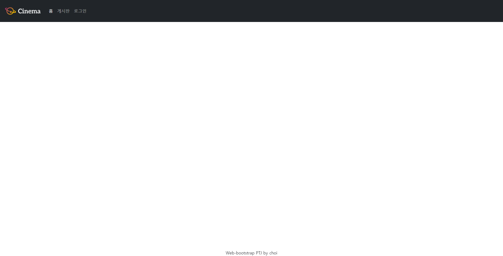
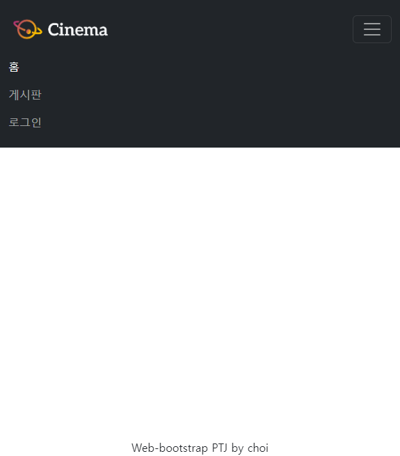
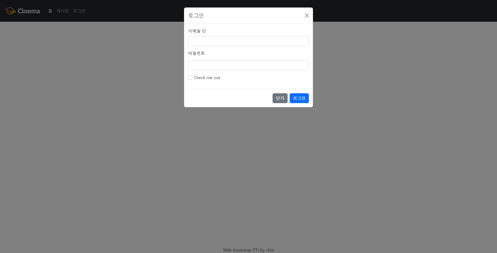
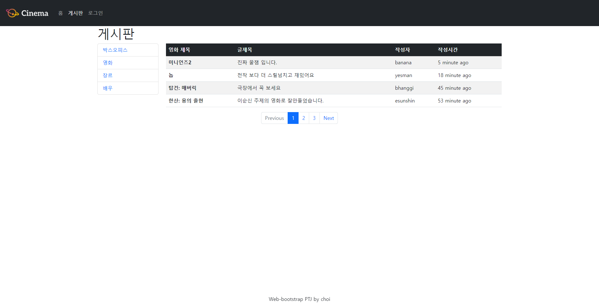
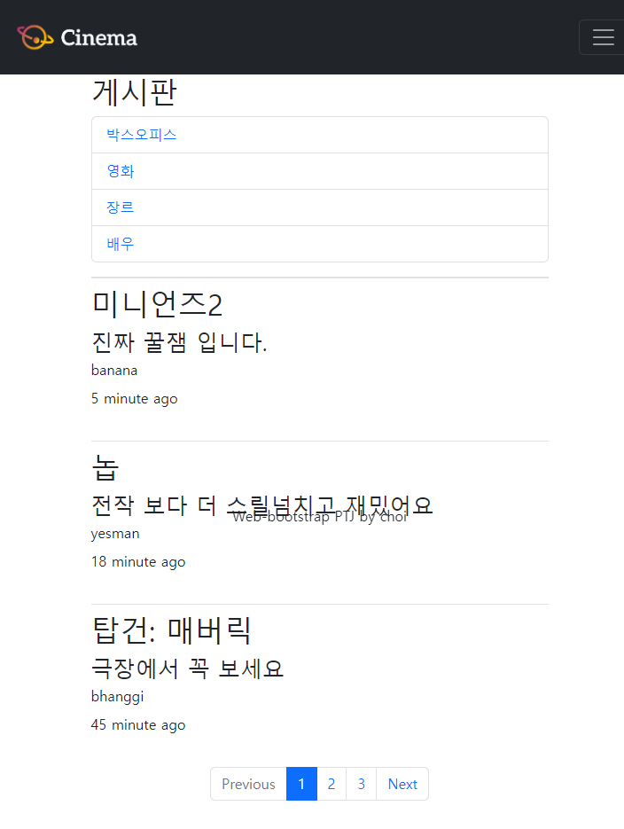

# 01_nav_footer.html

## 요구사항

- Nav는 스크롤을 하더라도 항상 화면 상단에 고정되어 있습니다.

- 로고 이미지는 제공된 logo.png를 사용합니다

- 로고 이미지는 하이퍼링크 역할도 가능하며 클릭 시 02_home.html로 이동해야 합니다.

- 내비게이션 메뉴 중 Home, Community는 하이퍼링크 역할도 가능하며 클릭 시 각각
  02_home.html, 03_community.html로 이동해야 합니다.

- Footer는 스크롤을 하더라도 항상 화면 하단에 고정되어 있습니다.

- . Footer에 작성된 내용은 수직·수평 가운데 정렬되어 있습니다.

# 02_home.html

## 요구사항

- 개별 요소들은 좌우 일정한 간격을 가집니다.

- Viewport의 가로 크기가 576px 미만일 경우 한 행에 1개씩 표시됩니다.

- Viewport의 가로 크기가 576px 이상일 경우 한 행에 2개 이상 표시됩니다.

# 03_community.html

## 요구사항

- 내부의 각 항목은 클릭이 가능한 하이퍼링크이지만, URL은 별도로 없습니다

- Viewport의 가로 크기가 992px 미만일 경우
  HTML main 요소 영역 전체만큼의 너비를 가집니다.

- Viewport의 가로 크기가 992px 이상일 경우
  HTML main 요소 영역 기준으로 좌측 1/6 만큼의 너비를 가집니다.

- Viewport의 가로 크기가 992px 미만일 경우
  게시판은 HTML article 요소의 집합으로 표시되며,
  HTML main 요소 영역 전체만큼의 너비를 가집니다.

- Viewport의 가로 크기가 992px 이상일 경우
  게시판은 Bootstrap Tables Content로 구성되며,
  HTML main 요소 영역 기준으로 우측 5/6 만큼의 너비를 가집니다.

- Pagination은 자신의 영역 안에서 수평 중앙 정렬되어 있습니다.

# 결과

### Nav_footer

### Home

### Community

