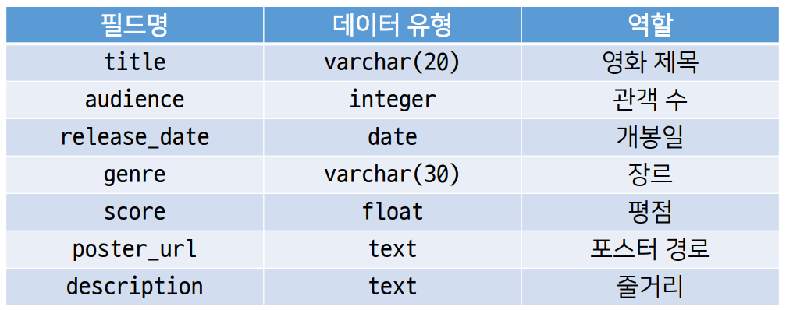
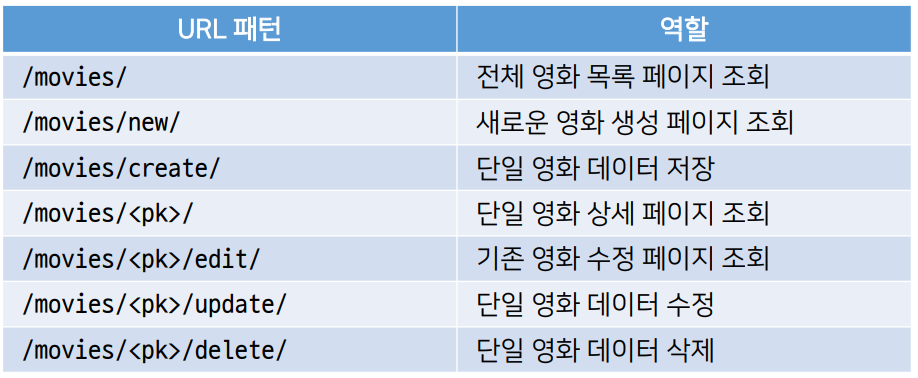
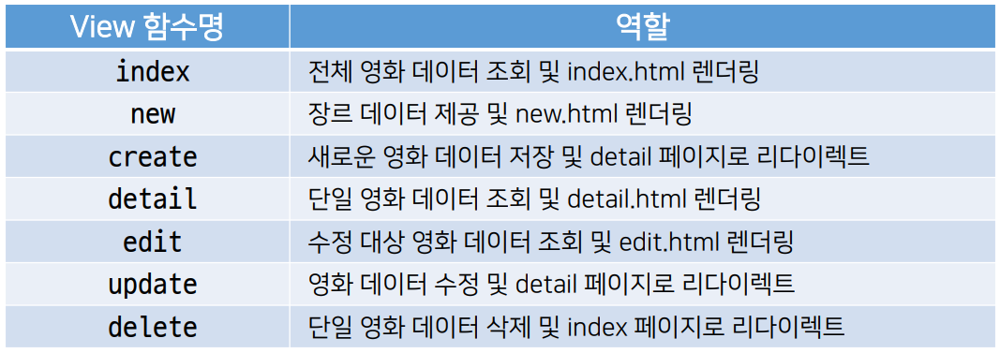
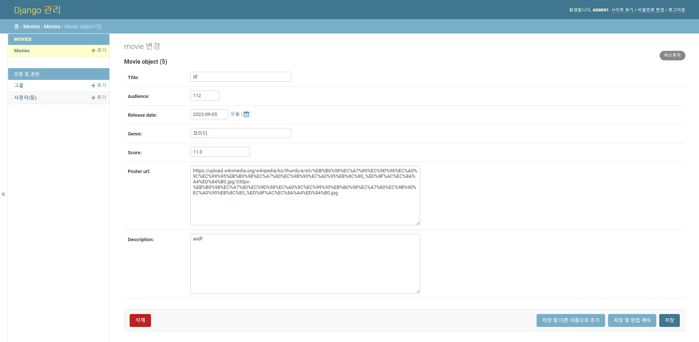
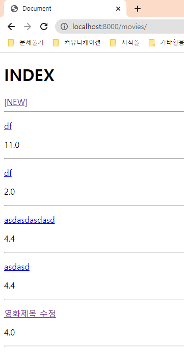
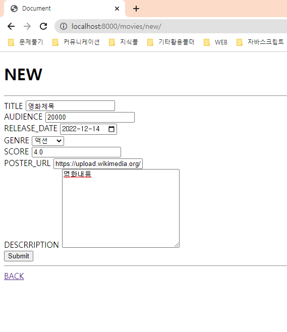
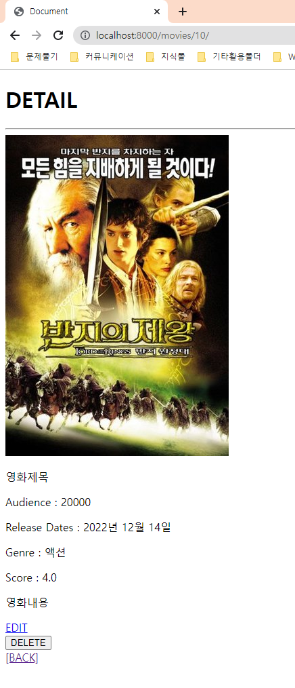
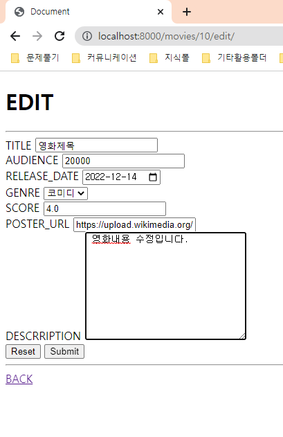
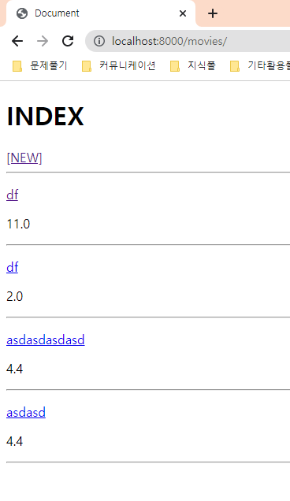

### 0. 준비사항

1. python -m venv venv
2. source venv/Scripts/activate
3. pip install -r requirements.txt
4. python manage.py makemigrations
5. python manage.py migrate

### 1. 요구사항

1. 목표: 커뮤니티 웹 서비스의 데이터 구성단계로써 영화 데이터의 생성, 조회, 수정, 삭제를 목표로 한다.
2. 공통 요구사항
- 프로젝트 이름은 mypjt, 앱 이름은 movies로 한다.
3. Model



4. URL



5. view



6. admin
- 모델 Movie를 admin site에 등록합니다.


### 2. 코드

##### 0. 모델

```python
from django.db import models

# Create your models here.
class Movie(models.Model):
    title = models.CharField(max_length=20)
    audience = models.IntegerField()
    release_date = models.DateField()
    genre = models.CharField(max_length=30)
    score = models.FloatField()
    poster_url = models.TextField()
    description = models.TextField()

```

 

##### 1. 어드민 페이지 등록

```python
from django.contrib import admin
from .models import Movie

# Register your models here.
admin.site.register(Movie)
```

### 

##### 2. views 작성(CRUD)

```python
from django.shortcuts import render,redirect
from .models import Movie
# Create your views here

# 게시글 전체 조회
def index(request):
    movies = Movie.objects.all()
    context = {
        'movies' : movies
    }
    return render(request,'index.html',context)

# 게시글 생성페이지로 이동
def new(request):
    return render(request,'new.html')

# 게시글 생성
def create(request):
    title = request.POST.get('title')
    audience = request.POST.get('audience')
    release_date = request.POST.get('release_date')
    genre = request.POST.get('genre')
    score = request.POST.get('score')
    poster_url = request.POST.get('poster_url')
    description = request.POST.get('description')

    movie = Movie(title=title,audience=audience,release_date=release_date,genre=genre,score=score,poster_url=poster_url,description=description)
    movie.save()

    return redirect('detail', movie.pk)

# 게시글 상세 페이지
def detail(request,pk):
    movie = Movie.objects.get(pk=pk)
    context = {
        'movie' : movie,
    }
    return render(request,'detail.html', context)

# 게시글 수정 페이지
def edit(request, pk):
    # print(pk)
    movie = Movie.objects.get(pk=pk)
    context = {
        'movie' : movie,
    } 
    return render(request,'edit.html', context)

# 게시글 수정
def update(request, pk):
    movie = Movie.objects.get(pk=pk)
    movie.title = request.POST.get('title')
    movie.audience = request.POST.get('audience')
    movie.release_date = request.POST.get('release_date')
    movie.genre = request.POST.get('genre')
    movie.score = request.POST.get('score')
    movie.poster_url = request.POST.get('poster_url')
    movie.description = request.POST.get('description')

    movie.save()
    return redirect('detail', movie.pk)

# 게시글 삭제
def delete(request, pk):
    movie = Movie.objects.get(pk=pk)
    movie.delete()
    return redirect('index')
```

### 3. 결과

##### 0. 어드민 페이지



##### 1. 전체 게시글 조회



##### 2. 게시글 작성



##### 3. 게시글 상세 페이지



##### 5. 게시글 수정



##### 6. 게시글 삭제



### 04_Pjt 후기

#### 많이 배울 수 있었던 시간이었습니다.

1. 사소한 부분에서 코드를 놓친 부분이 많아서 다시한번 복습할 수 있었습니다.

2. 이전에 팀프로젝트는 사실상 각자가 작업한것을 조립한 느낌이였다면 이번에는 다같이 하나하나 만들어가는 느낌이 들어서 재밌었습니다.

3. 뿐만아니라, 단순히 3명이서 진행할 뿐만 아니라 다른 학생들과 진행하는것을 교류하고 서로 에러가 발생한 부분을 공유해서 진행하는점이 좋았습니다.

#### 코드 부분.

1. 모델링 부분과 필터사용이 익숙하지않아서 힘들었습니다.

2. 특히, 서버를 재시작하지 않아서 에러가 발생하고 이를 해결하지 못해서 지체된 경험이 3번이나 있어서 이번에 확실히 배울 수 있었습니다.

3. 이전에 혼자 과제를 할때는 model -> html -> url -> view -> html 순으로 작업했었는데 다른 사람들과 작업하면서 다른 순서로 작업하였고 다른 순서 또한 배울 수 있었던 기회였습니다.

4. 날짜 필터의 경우, 애초에 string형태로 저장되는 것은 알았지만 꺼내서 사용할때 date필터를 통해서 바꿔줘야된다는것을 알게되었습니다.
