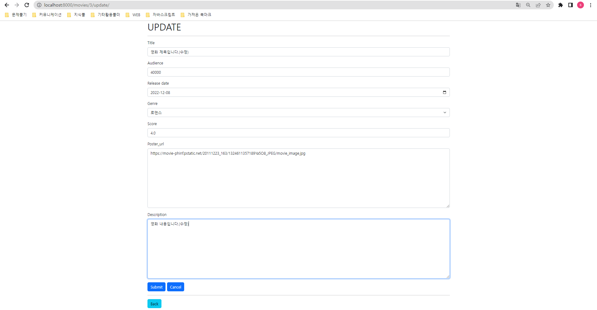

### 0. 준비사항

1. python -m venv venv
2. source venv/Scripts/activate
3. pip install -r requirements.txt
4. python manage.py makemigrations
5. python manage.py migrate

### 1. 요구사항

1. 목표: 커뮤니티 웹 서비스의 데이터 구성단계로써 영화 데이터의 생성, 조회, 수정, 삭제를 목표로 한다.
2. 공통 요구사항
- 프로젝트 이름은 mypjt, 앱 이름은 movies로 한다.
3. Model
   
   

4. URL
   
   

5. view
   
   

6. admin
- 모델 Movie를 admin site에 등록합니다.

### 2. 코드

##### 0. 모델

```python
from django.db import models

# Create your models here.
class Movie(models.Model):
    title = models.CharField(max_length = 20)   # 영화제목
    audience = models.IntegerField()            # 관객 수
    release_date = models.DateField()           # 개봉일
    genre = models.CharField(max_length=30)     # 장르
    score = models.FloatField()                 # 평점
    poster_url = models.TextField()             # 포스터 경로
    description = models.TextField()            # 줄거리

    def __str__(self):
        return self.title
```

##### 1. 어드민 페이지 등록

```python
from django.contrib import admin
from .models import Movie

# Register your models here.
admin.site.register(Movie)
```

##### 2. forms 작성

```python
from django import forms
from .models import Movie

class MovieForm(forms.ModelForm):
    title = forms.CharField(
        label='Title',
        label_suffix= ' ',
        widget = forms.TextInput(
            attrs = {
                'class': 'movie_title form-control',
                'placeholder': 'Title',
                'maxlength': 20,
            }
        )        
    )

    audience = forms.IntegerField(
        label='Audience',
        label_suffix= ' ',
        widget = forms.NumberInput( #TextInput으로 할지 고민
            attrs = {
                'class': 'movie_audience form-control', # form control: 줄바꾸고 자동으로 만들어줌
                'placeholder': 'Audience',
            }
        )        
    )

    release_date = forms.DateField(
        # label='Release date',
        # label_suffix= ' ',
        #input_formats=['%Y-%m-%d'],
        widget = forms.DateInput(
                        # format = '%Y-%m-%d',
            attrs = {
                # 'class': 'movie_release_date form-control',
                'type': 'date',
            }
        )        
    )

    genre_list = [('comedy','코미디'), ('romance','로맨스'), ('horor','공포')]
    genre = forms.CharField(
        label='Genre',
        label_suffix= ' ',
        widget = forms.Select(
            choices= genre_list,
            attrs = {
                'class': 'Genre form-control',                
            }
        )        
    )

    score = forms.FloatField(
        label='Score',
        label_suffix= ' ',
        widget = forms.NumberInput(
            attrs = {
                'class': 'movie_score form-control',
                'step': 0.5,
                'min': 0.0,
                'max': 5.0,
                'placeholder': 'Score',
            }
        )        
    )

    poster_url = forms.CharField(
        label='Poster_url',
        label_suffix= ' ',
        widget = forms.Textarea(
            attrs = {
                'class': 'movie_poster_url form-control',
                'placeholder': 'Poster_url',
            }
        )        
    )

    description = forms.CharField(
        label='Description',
        label_suffix= ' ',
        widget = forms.Textarea(
            attrs = {
                'class': 'movie_description form-control',
                'placeholder': 'Description',
            }
        )        
    )

    class Meta:
        model = Movie
        fields = '__all__'
```

##### 3. views 작성(CRUD)

```python
from django.shortcuts import render,redirect
from django.views.decorators.http import (require_http_methods, require_POST, require_safe)
from .forms import MovieForm

# Create your views here.
from .models import Movie

# 전체 조회
def index(request):
    movies = Movie.objects.all()
    context = {
        'movies': movies,
    }
    return render(request, 'movies/index.html', context)

# methods 제한.
# 게시글 생성, 생성페이지로 이동
@require_http_methods(['GET', 'POST'])
def create(request):
    # 게시글 생성
    if request.method == 'POST':
        form = MovieForm(request.POST)
        if form.is_valid():
            movie = form.save()
            # return render(request, 'movies/detail.html', context)
            return redirect('movies:detail', movie.pk)
    # 게시글 생성페이지로 이동
    else:
        form = MovieForm()
    context = {
        'form': form,
    }
    return render(request, 'movies/create.html', context)

# 게시글 상세페이지로 이동
def detail(request,pk):
    movie = Movie.objects.get(pk=pk)
    context = {
        'movie': movie,
    }
    return render(request, 'movies/detail.html', context)

@require_http_methods(['GET', 'POST'])
# 게시글 수정, 수정페이지로 이동
def update(request, pk):
    movie = Movie.objects.get(pk=pk)
    # 게시글 수정
    if request.method == 'POST':
        form = MovieForm(request.POST, instance=movie)
        if form.is_valid():
            form.save()
            return redirect('movies:detail', movie.pk)
    # 게시글 수정페이지로 이동
    else:
        form = MovieForm(instance=movie)
    context = {
        'form': form,
        'movie': movie,
    }
    return render(request, 'movies/update.html', context)

# 게시글 삭제
def delete(request, pk):
    movies = Movie.objects.get(pk=pk)
    movies.delete()

    return redirect('movies:index')
```

##### 4. 결과

###### 0. 관리자 페이지


###### 1. 전체 조회


###### 2. 게시글 생성


###### 3. 게시글 상세 페이지


###### 4. 게시글 수정



###### 5. 게시글 삭제


### 05_pjt 후기

프로젝트 후기

작업순서: model, form, url, views, html 순으로 작업했습니다.

model

1. model 자체는 주어진 명세서를 따라했기 때문에 특이점이 없었습니다.

2. 그러나 마지막에 admin작업을 하면서 작동을 하지 않았고 원인을 찾지 못했었습니다. 한참을 찾다가 에러 코드로 return str에 문제가 있다는것을 발견하였고 무작정 model을 따라치다가 의미도 모른채 사용했던 def str(self) 부분에서 return self로 인해서 에러가 발생함을 찾을 수 있었습니다.

3. 덕분에 model.py에서 def str(self)가 없어도 admin에서는 확인이 가능하다는 점과 return시 self.요소 를 선택하여 admin에서 불필요한 정보를 제외하고 필요한 정보들로만 확인 가능하다는 것을 알 수 있었습니다.

form

1. select, date field 등 생소한 widget들을 사용해보고 부트스트랩의 cotrol-form을 이용하여 깔끔하게 정리할 수 있었습니다.

2. 기존에는 html에서 직접 form을 만들고 bootstrap을 활용하여 css를 설정하였습니다. 그러나 modelform을 쓰면서 완벽하게 제가 원하는 스타일로 만들기는 어렵지만, 간단하고 깔끔하게 만드는데 이점이 있다는 것을 배웠습니다.

views와 html을 작업하면.

1. 전체적인 작업 흐름을 다시 한번 확인할 수 있었습니다.

2. 해당 프로젝트에서는 로그인, 인증 등은 따로 적용하지 않았기에 다음에 기회가 있다면, 로그인부터 시작하여 이전에 작업했던 movie api까지 활용해서 실제 작업을 한번 해보고 싶었습니다.
