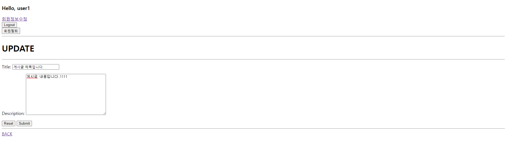

# 06_pjt

### 0. 준비사항

1. python -m venv venv

2. source venv/Scripts/activate

3. pip install -r requirements.txt

4. python manage.py makemigrations

5. python manage.py migrate

### 1. 학습 내용

1. user
   
   1. accounts > forms.py
      
      - django에서는 유저생성과 변경에 관한 기본적인 form이 있다.(usercreationform...)
        
        ```python
        class CustomUserCreationForm(UserCreationForm):
          class Meta:
              # get_user_model()을 사용해 Django에서 제공하는 유저 모델을 그대로 사용한다.
              # 단, 유저 셍성에서는 username과 email만 가져다 쓰겠다.
              model = get_user_model()
              fields = ('username', 'email',)
        
        class CustomUserChangeForm(UserChangeForm):
          class Meta:
              model = get_user_model()
              fields = ('email',)
        ```
   
   2. accounts > views.py > change_password
      
      - django에서 제공하는 passwordchangeform
        
        ```python
        # 비밀번호 변경
        @login_required
        @require_http_methods(['GET', 'POST'])
        def change_password(request):
          if request.method == 'POST':
              # 장고에서 제공하는 passwordchangeForm
              form = PasswordChangeForm(request.user, request.POST)
              if form.is_valid():
                  form.save()
                  # 보안을 위해서 비밀번호는 hash처리한다.
                  update_session_auth_hash(request, form.user)
                  return redirect('movies:index')
          else:
              form = PasswordChangeForm(request.user)
          context = {
              'form': form,
          }
          return render(request, 'accounts/change_password.html', context)
        ```
   
   3. movies > models.py
      
      - 외래키 사용(게시글-사용자, 댓글-게시글, 댓글-사용자)
        
        ```python
        # settings.AUTH_USER_MODEL이란? 아래서 설명.
        class Movie(models.Model):
          user = models.ForeignKey(settings.AUTH_USER_MODEL, on_delete=models.CASCADE)
          title = models.CharField(max_length=20)
          description = models.TextField()
        
        class Comment(models.Model):
          movie = models.ForeignKey(Movie, on_delete=models.CASCADE)
          user = models.ForeignKey(settings.AUTH_USER_MODEL, on_delete=models.CASCADE)
          content = models.CharField(max_length=100)
        ```
      
      ```python
       # accounts > models.py
       from django.contrib.auth.models import AbstractUser
      
       class User(AbstractUser):
           pass
       # auth.models.AbstractUser 를 상속받은 User 모델을 사용할 것이다. pass라고 되어 있지만,
       # 실제로 상속된 내용 모두가 들어가며, 이것이 커스텀 유저 모델이 된다.
       #------------------------------------------------------------------
      
       # project > settings.py
       AUTH_USER_MODEL = 'accounts.User' 
      
       # 즉, settings.AUTH_USER_MODEL은 accounts의 User 모델을 의미.
      ```
   
   4. 댓글 생성
      
      ```python
       # url
       path('<int:movie_pk>/comments/<int:comment_pk>/delete/', views.comments_delete, name='comments_delete')
      
       # views
       # 여기서 pk는 게시글의 pk이다.
       @require_POST
       def comments_create(request, pk):
           if request.user.is_authenticated:
               movie = Movie.objects.get(pk=pk)
               comment_form = CommentForm(request.POST)
               if comment_form.is_valid():
                   comment = comment_form.save(commit=False)
                   comment.movie = movie
                   comment.user = request.user
                   comment.save()
               return redirect('movies:detail', movie.pk)
           return redirect('accounts:login')
      ```
   
   5. 데코레이터
      
      ```python
       # @require_safe: 사용자가 해당 페이지에 접속할 때 정보 확인 외에
       # 다른 행동(데이터작성 등)을 못하게 방지하는 데코레이터 
       # 보통 조회관련 및 불필요한 수정작업을 막아야하는곳에 사용.
       @require_safe
      ```


### 2. 실행화면

##### 1. INDEX 페이지


##### 2. 회원가입


##### 3. 로그인


##### 4. 로그인후 INDEX


##### 5. 회원정보 수정(이메일)


##### 6. 회원정보 수정(비밀번호)


##### 7. 게시글 생성


##### 8. 게시글 상세(로그인)


##### 9. 게시글 상세(로그아웃)


##### 10. 게시글 수정



##### 11. 댓글 생성


##### 12. 댓글 삭제


##### 13. 게시글 삭제


