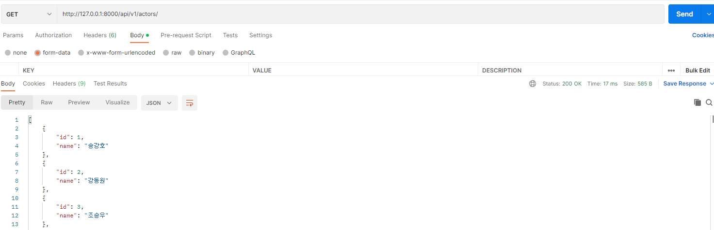
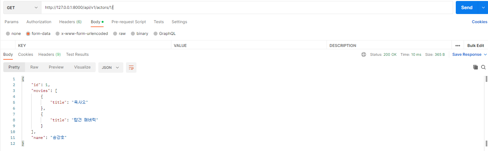
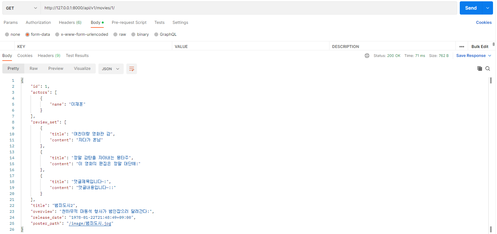
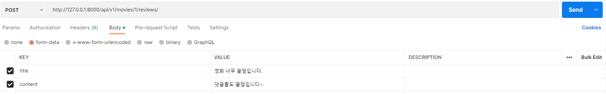
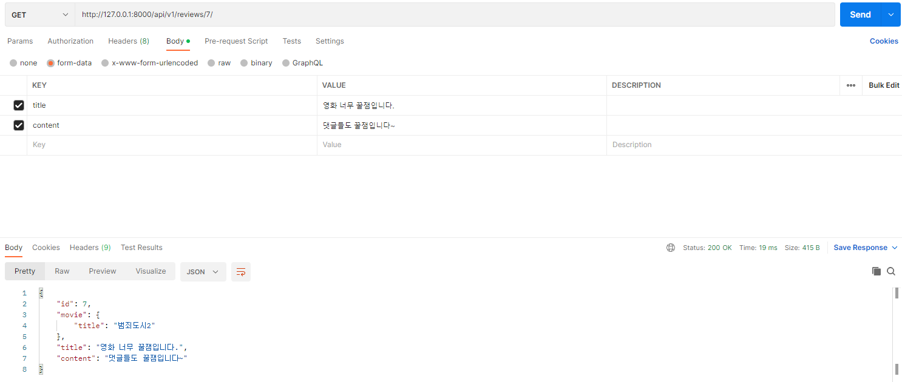
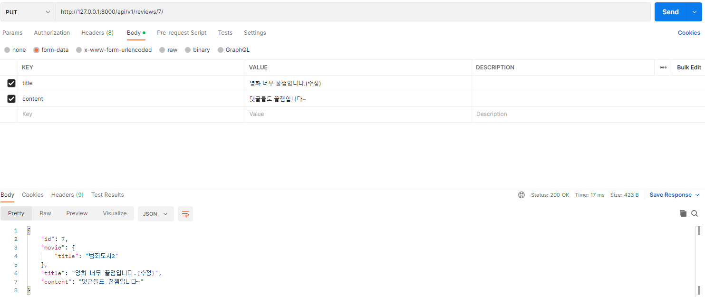
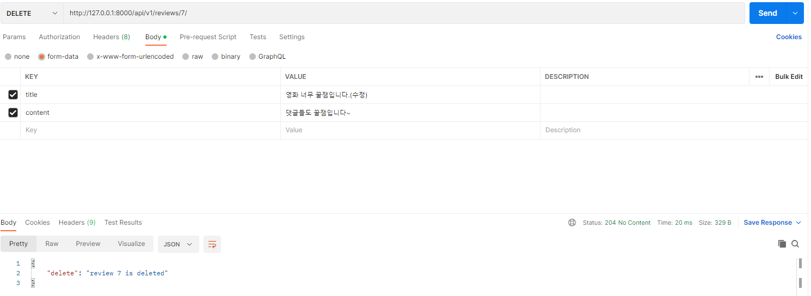

# 07_pjt

### 0. 준비사항

1. python -m venv venv

2. source venv/Scripts/activate

3. pip install -r requirements.txt

4. python manage.py makemigrations

5. python manage.py migrate

6. python manage.py loaddata movies/actors.json movies/movies.json movies/reviews.json

### 1. 학습 내용

1. 해당 프로젝트 목표
   
   - 이제는 django를 server로 사용한다. json형식의 데이터를 가공하여 client쪽으로 던질 계획이다.
   - 그 결과 요청받은 데이터(request.data)와 DB에서 꺼내줄 데이터(get_list_or404(모델), get_object_or_404(모델,pk=pk))를 json형식으로 바꿔줘야한다.(serializer)
   - @api_view 데코레이터로 응답결과를 보여주는 페이지로 확인 가능하지만 POSTMAN을 활용하여 보고자 한다.

2. models.py
   
   ```python
    from django.db import models
   
    class Actor(models.Model):
        name = models.CharField(max_length=100)
   
    class Movie(models.Model):
        # 배우와 영화는 다대다 관계
        # related_name='movies'는 역참조시 사용할 계획
        actors = models.ManyToManyField(Actor, related_name='movies')
        title = models.CharField(max_length=100)
        overview = models.TextField()
        release_date = models.DateTimeField()
        poster_path = models.TextField()
   
    class Review(models.Model):
        movie = models.ForeignKey(Movie, on_delete=models.CASCADE)
        title = models.CharField(max_length=100)
        content = models.TextField()
   ```

3. URL 특징.
   
   ```python
    # api/v1/ 경로를 기본으로 설정
    path('api/v1/', include('movies.urls')),
   ```

4. Serializers > movie.py
   
   ```python
    from rest_framework import serializers
    from ..models import Movie, Actor, Review
   
    class MovieListSerializer(serializers.ModelSerializer):
        class Meta:
            model = Movie
            fields = ('title', 'overview',)
   
    class MovieSerializer(serializers.ModelSerializer):
   
        class ActorSerializer(serializers.ModelSerializer):
            class Meta:
                model = Actor
                fields = ('name',)
   
        class ReviewListSerializer(serializers.ModelSerializer):
            class Meta:
                model = Review
                fields = ('title', 'content')
   
                                # many는 단일데이터가 아닐경우, read_only는 수정불가능
        actors = ActorSerializer(many=True, read_only=True)
        review_set = ReviewListSerializer(many=True, read_only=True)
   
        class Meta:
            model = Movie
            fields = '__all__'
   ```

5. views.py
   
   ```python
    @api_view(['GET'])
    def actor_list(request):
        # 전체 리스트 조회할때는 get_list_or_404(모델)
        actors = get_list_or_404(Actor)
        # 받아온 정보가 복수일 경우, many=True를 설정해야된다.
        serializer = ActorListSerializer(actors, many=True)
        return Response(serializer.data)
   
    @api_view(['GET'])
    def actor_detail(request, actor_pk):
        # 단일 정보 조회할때는 get_object_or_404(모델, pk=pk)
        actor = get_object_or_404(Actor, pk=actor_pk)
        serializer = ActorSerializer(actor)
        return Response(serializer.data)
   ```

### 2. 실행화면

1. 배우 전체 리스트
   
   

2. 배우 단일 조회
   
   

3. 게시글 전체 리스트
   
   

4. 게시글 단일 조회
   
   

5. 댓글 전체 리스트
   
   

6. 댓글 생성
   
   

7. 댓글 단일 조회
   
   

8. 댓글 단일 수정
   
   

9. 댓글 단일 삭제
   
   
