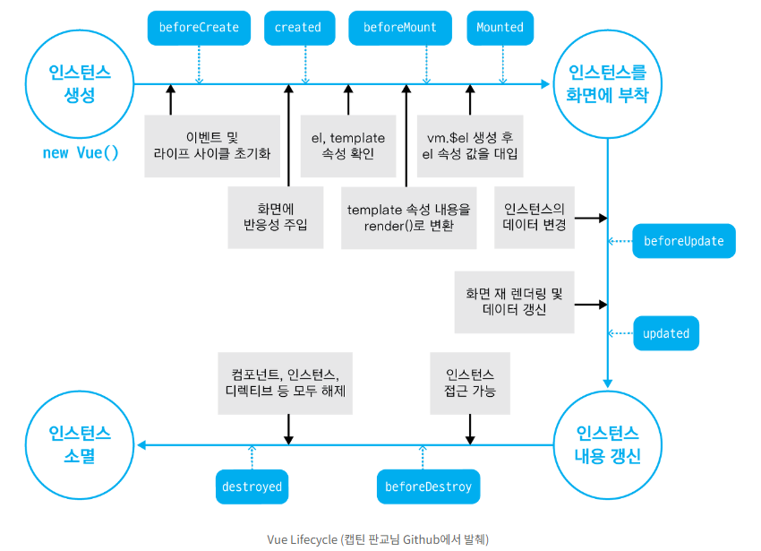

# 07_pjt

### 0. 준비사항

1. npm i

2. npm run serve

### 1. 학습 내용

1. 해당 프로젝트 목표
   
   - vue에서 api통신과 부트스트랩을 포함한 패키지 적용방법을 학습

2. created()



### 2. api 통신

```vue
    import axios from "axios";  

    created(){
        this.getTopRate()
    },
    methods: {
        async getTopRate() {
        const API_KEY = process.env.VUE_APP_TMDB_API_KEY;
        const API_URL = process.env.VUE_APP_TOPRATE_API_URL;
        try {
            const response = await axios.get(API_URL, {
            params: {
                api_key: API_KEY,
                language: "ko-KR",
                // page: 1,
            },
            });
            this.movies = response.data.results
        } catch (error) {
            console.log(error);
        }
        },
    },
```

인스턴스 생성직후 created를 통해서 api를 요청하여 데이를 받아와 this.movies에 저장한다.
주의할점은 axios통신을 하기때문에 import해줘야하고 try~catch를 사용해야 한다는점
가장 중요한것은 외부 api에 통신할때는 무조건 문서(docs)를 참고해야 한다.

### 3. 화면

1. 인기영화 20개
   
   

2. 랜덤 영화
   
   

3. 영화 검색해서 저장 및 삭제

    


### 4. 후기
- vue에서 외부 api통신을 활용하여 데이터를 받아오고 활용하는 방법을 배웠습니다. 이제는 django와 합쳐서 server api에 요청하는 방법을 배워보고 싶습니다.

- created()를 통해서 페이지 접속시 api를 요청하면서 20개의 데이터만 받아와도 속도가 생각한것보다 느린데 대용량의 경우 어떻게 처리해야될지 의문입니다.

- 지금은 외부 api를 통해서 데이터를 받고 vue에서 데이터를 가공하지만, 만약 django server와 통신할때는 server에서 데이터를 가공해서 주는게 빠를지 궁금하고 그렇다면 api가 너무 많아지는게 아닌가 생각했었습니다.