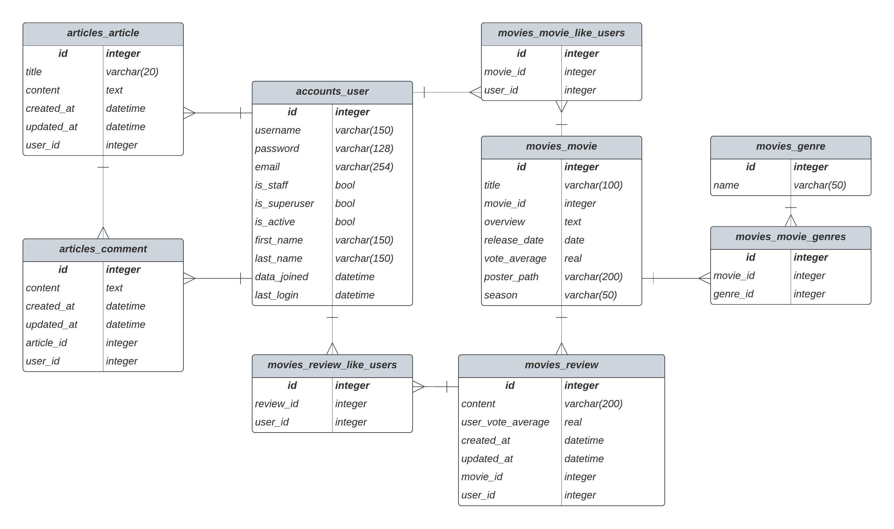

##### 1. 팀원 정보 및 업무 분담내역

- 신지원
  
  - vue 컴포넌트 구성, 전체적인 CSS, api요청 작업

- 조한이
  
  - DB모델 작성, django(url, views) 작성, vue 컴포넌트 구성, 전체적인 CSS

- 최원준(팀장)
  
  - DB모델 작성, django(url, views) 작성, vue.js(data 요청)


##### 2. 목표 서비스 구현 및 실제 구현 정도

- 목표 서비스
  
  - 커뮤니티와 알고리즘을 활용한 영화 추천

- 실제 구현 정도
  
  - 커뮤니티 부족
    
    - 각 영화를 게시글, 영화 평점과 리뷰를 댓글 형식으로 구현하여 커뮤니티라고 생각하였으나 User to User가 부족.
    
    - 추가적으로 게시판을 만들었으나 게시글 생성 및 조회까지만 구현
  
  - 알고리즘을 활용한 영화 추천
    
    - 유저가 찜한 영화의 장르를 카운팅하여 해당 장르에 맞는 영화를 추천


##### 3. ERD




##### 4. 영화 추천 알고리즘

```js
created(){
    this.getRecommend()
  },
  methods:{
    getRecommend() {
      const URL = 'http://127.0.0.1:8000'
      axios({
        method: 'get',
        url: `${URL}/api/v1/movies/`,
      })
        .then((res) => {
          // 0. created로 전체 영화정보를 json형식으로 받는다.(res.data)

          // 1. 유저가 찜한 영화를 파악한다.
          const mymovies = res.data.filter(movie => movie.like_users.includes(this.$store.state.user_pk));

          // 2. 유저가 찜한 영화의 장르를 객체로 정리한다.
          var tmp = {}
          mymovies.forEach(movie => {
            var genre = movie.genres[0]
            if(genre in tmp){
              tmp[genre] += 1
            }else{
              tmp[genre] = 1
            }
          });

          // 3. 정리한 객체를 배열-객체 형태로 바꿔준다.

          // 장르의 키값을 배열로 뽑는다.
          var keyList = Object.keys(tmp)
          var tastes = []

          // 해당 장르배열을 순회하면서 장르와 값을 객체로 만들고 배열에 저장
          for(let index in keyList){
            let contrib = {
              pk: keyList[index],
              cnt: tmp[keyList[index]]
            }
            tastes.push(contrib)
          }

          // 4. 가장 많이 찜한 영화의 장르 순서대로 정렬한다.
          var sort_tastes = tastes.sort((a,b) => (b.cnt - a.cnt));

          // 5. 해당 배열의 길이에 따라 최대 3개의 장르영화를 data(movies)에 담아 추천한다.
          if(sort_tastes.length > 0){
            res.data.forEach(movie => {
                if(movie.genres[0] == sort_tastes[0].pk){
                  this.movies.push(movie)
              }
            })
          }
          if(sort_tastes.length > 1){
            res.data.forEach(movie => {
                if(movie.genres[0] == sort_tastes[1].pk){
                  this.movies.push(movie)
              }
            })
          }
          if(sort_tastes.length > 2){
            res.data.forEach(movie => {
                if(movie.genres[0] == sort_tastes[2].pk){
                  this.movies.push(movie)
              }
            })
          }
        })
        .catch((err) => {
          console.log(err)
        })
    },
```


##### 5. 서비스 대표 기능에 대한 설명

- 영화 데이터에 계절 태그를 설정하여 특정 계절에 맞는 영화를 추천

- 영화를 찜할 경우, 해당 영화들을 모아서 확인할 수 있습니다.

- 리뷰에 좋아요를 표시할 경우, 해당 수를 확인할 수 있습니다.

- 전체 영화목록에서 영화 제목을 검색하여 찾을 수 있습니다.


##### 6. 후기

이번 프로젝트를 진행하면서 협업, django와 vue.js, git에 대해서 많이 배울 수 있었습니다.

특히, 저희는 3인으로 작업을 진행해야 되었기에 의견을 조율하고 작업을 분배하는것에도 어려움이 있었고 덕분에 어떻게 협업을 진행해야 되는지 배울 수 있었습니다.

프로젝트를 진행하면서 새롭게 알게되는 정보들 뿐만 아니라 이전에 학습한 내용을 어디까지 이해한지 확인할 수 있었습니다. 이에 부족한 부분을 팀원뿐만 아니라 다른 프로젝트 팀원들과 공유하면서 문제를 해결해 나가면서 여러 사람들의 코드를 접하고 배울 수 있었습니다.

이전까지 단순하게 git을 활용하여 본인의 repository에 pull, push를 했었다면, 프로젝트를 진행하면서 git이 어떻게 작동하는지 짧게나마 경험할 수 있었습니다.

아직 게시판 부분이 미완성된 부분이 많았기에 추후 수정을 통하여 게시판까지 기능을 구현하고자 합니다.


해당 프로젝트를 마치며 같이 프로젝트 진행해준 팀원분들과 제 4의 멤버로 활동해주신 다른 프로젝트 팀원 분들과 교수님께 감사인사 드립니다.
